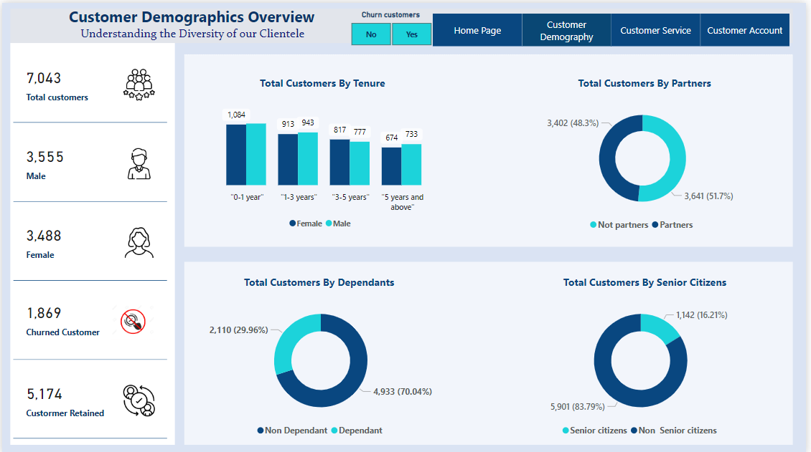

A brief description of what this project does and who it's for

## PWC Power BI Virtual work experience - Customer Churn Retention

## Dashboard: 
[View Dashboard](https://app.powerbi.com/view?r=eyJrIjoiOWM4YTFlMzktZTg4Zi00ZmUwLTg4YmUtZjIwMmEyMGNhYzY5IiwidCI6IjU3ODFjYTE2LTUxYTYtNGU5OC05YmU5LWRjMmI5ZDAzYjgyZCJ9&pageName=ReportSection9110bf033128c018a249)

## Problem Statement

### Customer demographic background 

How can the company increase retention rates among specific demographic groups where churn is high?
What strategies can be implemented to attract a more balanced demographic in terms of gender or age to the customer base?
Which demographic groups contribute most to revenue, and how can the company better serve and retain these customers?

### Customers by Services Dashboard:

Which services have the highest churn rate, and what can be done to improve customer satisfaction and retention for those services?
Are there any services that are particularly successful in retaining customers, and can their strategies be applied to other services?
How do different services impact the overall profitability of the company, and how can they be optimized?

### Financial Insights Dashboard:

What impact does the method of payment have on customer retention and churn rates?
How does the adoption of paperless billing relate to overall customer satisfaction and financial performance?
Can the company improve financial outcomes by promoting certain payment methods or billing options?

### Overall Insights Across Dashboards:

How can the company leverage the interplay between demographics, service preferences, and financial behaviors to improve the customer experience?
What are the predictors of churn across different segments, and how can predictive analytics be used to preemptively address churn?
How can insights from the Net Promoter Score be used to create targeted interventions for customer segments with lower satisfaction levels?

## Datasource :

Dataset used for this task was presented by [Pwc](https://www.pwc.ch/en/careers-with-pwc/students/virtual-case-experience.html) and customer churn Retention dataset:

Dataset: [Customer Churn Retention](https://github.com/yogeshkasar778/PWC_task_2---Customer_Churn_Retension_dashboard/blob/main/02%20Churn-Dataset.xlsx)

## Data Preparation:

Completed the Data transformation in Power Query and the dataset loaded into Microsoft Power BI Desktop for modeling.

Churn_dataset is give table named:

- `churn_dataset` which has `23 columns and 7043 rows` of observation

Data Cleaning for the dataset was done in the power query editor as follows:

- Replaced  the value is `SeniorCitizen` N coverted No and Y converted Yes

In the new table, one additional conditional columns were added.
To calculate tenure range.

- Removed Unnecessary columns 
- Removed Unnecessary rows
- Each of the columns in the table were validated to have the correct data type.

## Data Modeling:

And then dataset was cleaned and transformed, it was ready to the data modeled.

## Data Analysis (DAX):

Measures used in  all visualization are:

-  Senior citizens = Senior citizens = CALCULATE(
           COUNTROWS('Churn-Dataset'),
           'Churn-Dataset'[SeniorCitizen]="Yes")

- Churned Customer %  = ` DIVIDE([Customer Churned],[Total Customers])`

 % Customer Retained = DIVIDE([Custormer Retained],[Total Customers])`% = DIVIDE([Customer Churned],[Total Customers])`

- churn count = `CALCULATE(COUNT('01 Churn-Dataset'[Churn]), ALLSELECTED('01 Churn-Dataset'[Churn]),'01 Churn-Dataset'[Churn] = "Yes")`

- churn rate % = `DIVIDE(CALCULATE(COUNT('01 Churn-Dataset'[Churn]), '01 Churn-Dataset'[Churn] = "yes" ), COUNT('01 Churn-Dataset'[Churn]), 0)`

- Dependent in % = `DIVIDE(CALCULATE(COUNT('01 Churn-Dataset'[Dependents]), '01 Churn-Dataset'[Dependents]="Yes",'01 Churn-Dataset'[Churn]="Yes"), CALCULATE(COUNT('01 Churn-Dataset'[Dependents]),'01 Churn-Dataset'[Churn]="Yes"), 0)`

- Device protection in % = `DIVIDE(CALCULATE(COUNT('01 Churn-Dataset'[DeviceProtection]), '01 Churn-Dataset'[DeviceProtection] ="Yes", '01 Churn-Dataset'[Churn]="Yes"),CALCULATE(COUNT('01 Churn-Dataset'[DeviceProtection]),'01 Churn-Dataset'[Churn]="Yes"),0)`

## Data Visualization (Dashboard):

Shows visualizations from Customer Retention analysis:

| Customer Demography |
| ----------- |
||

| Service opted by customer |
| ----------- |
||

## Insight

#### Demographic Insights:

Gender distribution is nearly even with 3,555 males and 3,488 females, suggesting that gender-targeted marketing strategies might not need to be heavily weighted toward one gender over the other.
The tenure distribution shows that a larger number of customers have been with the company for "0-1 year" (1,084 customers) and "1-3 years" (913 customers), indicating potential issues with long-term retention.
There is a nearly even split between customers with partners (3,641) and without (3,402), which may suggest that marital status doesn't significantly influence customer acquisition.
Service Preferences:

A significant number of customers without internet service (1,413) have churned, suggesting that customers are highly sensitive to the availability and quality of internet services.
Customers with tech support (1,734) have a lower churn rate, highlighting the importance of support services in customer retention.
The usage of streaming services (movies and TV) is high among retained customers, suggesting these services are valued and could be bundled more aggressively to attract and retain customers.
Financial Insights:

Total charges for customers with paperless billing (10,753K) are substantially higher than for those without (5,303K), indicating that customers who opt for paperless billing may have a higher lifetime value.
The highest total charges are observed in the "5 years and above" tenure range (7M), reinforcing the value of long-term customer retention.
The customer retention rate stands at 73.46%, while the churn rate is at 26.54%. These figures highlight the importance of strategies to increase the retention rate as three-quarters of the customer base is stable.
The Net Promoter Score is at 63.9%, suggesting that while the majority of customers are promoters, there is still a significant opportunity to improve customer satisfaction and loyalty.
